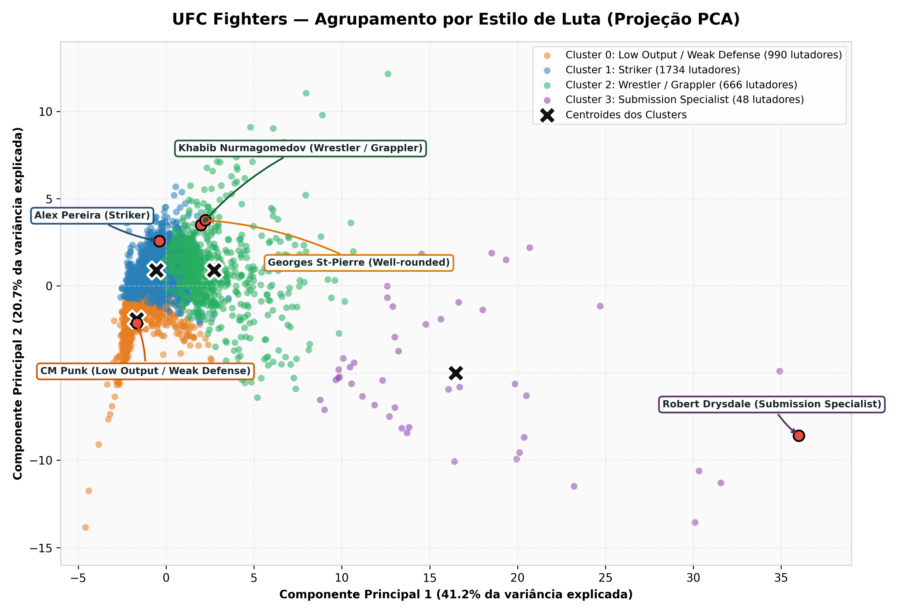
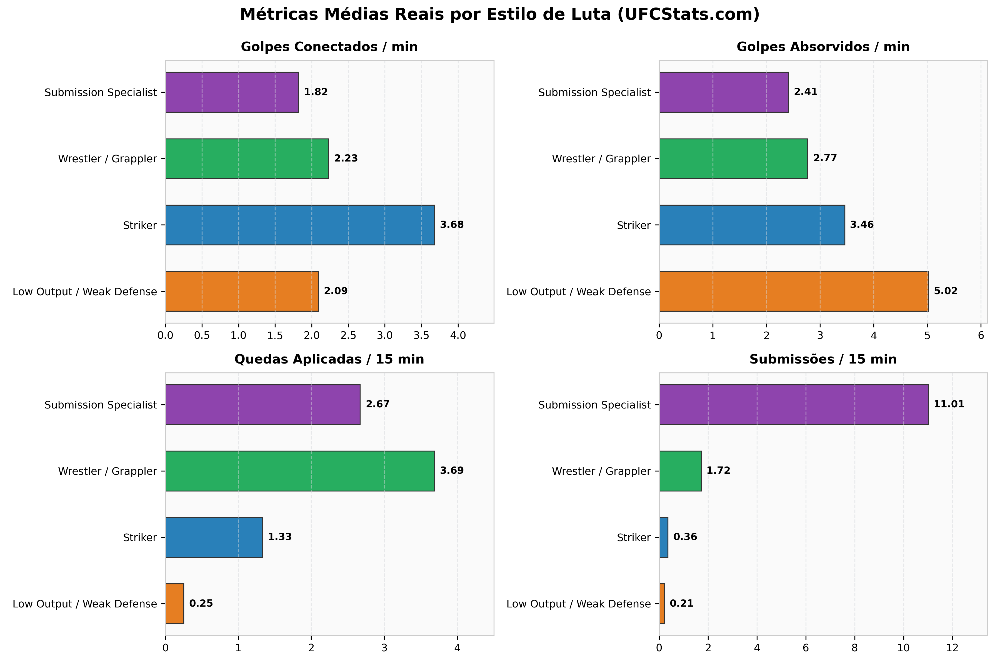
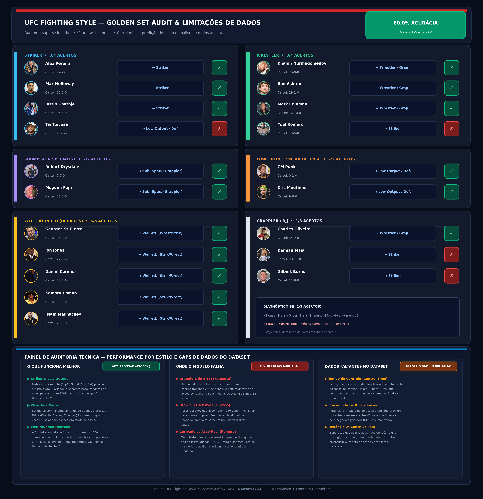
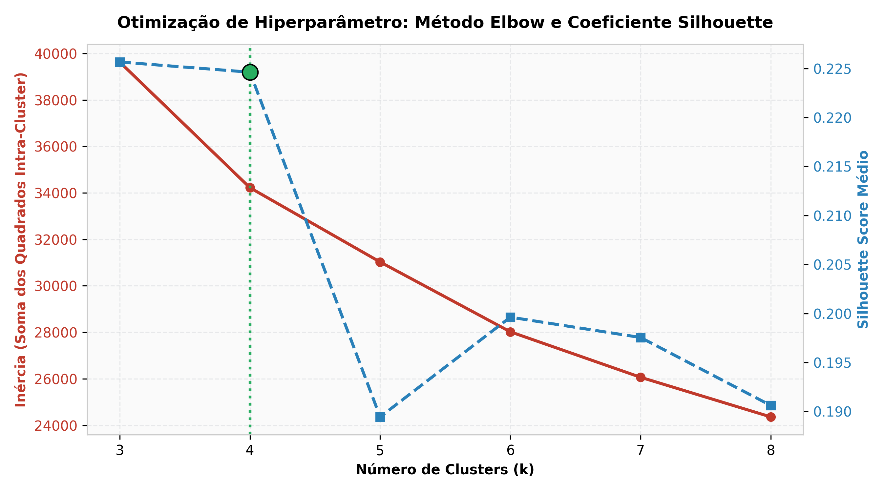

# Fighting Style Clustering — UFC Fighters

Pipeline de Machine Learning que agrupa lutadores do UFC por **estilo de luta** (*Striker*, *Wrestler / Grappler*, *Submission Specialist* e *Well-rounded / Híbrido*) a partir de estatísticas oficiais de performance, com classificação instantânea por nome/apelido e orquestração via Apache Airflow.

<p align="center">
  
</p>

---

## 📊 Dataset

- **Fonte**: UFCStats.com (`data/raw/ufc-fighters-statistics.csv`)
- **Dimensões**: 4.111 lutadores, 18 colunas (cartel, dados antropométricos e 8 métricas oficiais de striking, takedowns e submissões).
- **Tratamento de integridade**: 673 linhas (16,4%) possuíam todas as 8 métricas zeradas (dados ausentes históricos mascarados como zero no UFCStats). Foram filtradas na limpeza, resultando em uma base analítica consistente de **3.438 lutadores**.

---

## 🏛️ Arquitetura do Pipeline

```
data/raw/ufc-fighters-statistics.csv
        │
        ▼
┌─────────────────────────┐
│   preprocessing.py      │  Remove registros sem stats (673 nulos/zeros),
│                         │  normaliza variáveis via StandardScaler.
└───────────┬─────────────┘
            ▼
┌─────────────────────────┐
│ feature_engineering.py  │  Gera 3 features derivadas (saldo de striking,
│                         │  pressão de grappling e rating defensivo),
│                         │  aplica pesos (1.5x Takedown / 2.5x Submissão)
└───────────┬─────────────┘  e reduz dimensionalidade com PCA dinâmico (90% variância).
            ▼
┌─────────────────────────┐
│     train_model.py      │  K-Means (k=4, validado por Silhouette + Coesão),
│                         │  GMM avaliado como comparativo de auditoria.
└───────────┬─────────────┘
            ▼
┌─────────────────────────┐
│    evaluate_model.py    │  Perfila clusters nas unidades originais e atribui
│                         │  rótulos semânticos supervisionados por especialistas.
└───────────┬─────────────┘
            ▼
   reports/cluster_profile.csv
   reports/cluster_labels.json
   data/processed/fighters_clustered_labeled.parquet
            │
            ▼
┌─────────────────────────┐
│       scoring.py        │  Identificador de estilo: consulta instantânea por
│                         │  nome/apelido ou stats manuais com detecção de Well-rounded.
└─────────────────────────┘
```

Orquestrado pela DAG `dags/fighting_style_clustering_dag.py` (Airflow TaskFlow API) em ambiente Docker/WSL. Cada etapa do pipeline em `src/` opera como um módulo independente e testável individualmente via CLI.

---

## 🚀 Como Rodar

### 1. Consulta Rápida por Nome de Lutador (Scoring CLI)

Para consultar o estilo de luta de qualquer um dos **3.438 lutadores** do UFC diretamente no terminal:

```bash
# Busca direta pelo nome ou apelido
python src/scoring.py "Alex Pereira"
python src/scoring.py "Khabib"
python src/scoring.py "Charles Oliveira"
python src/scoring.py "Georges St-Pierre"

# Modo interativo com busca dinâmica e suporte a estatísticas manuais
python src/scoring.py
```

Exemplo de saída:
```text
================================================================
🥊 Alex Pereira "Poatan"
📊 Cartel: 9 Vitórias - 2 Derrotas - 0 Empates
================================================================
👉 Estilo de Luta: STRIKER (Cluster 1)
----------------------------------------------------------------
Métricas de Performance:
  • Golpes significativos dados/min: 5.00 (Precisão: 62.0%)
  • Golpes absorvidos/min:           3.70 (Defesa:   51.0%)
  • Quedas a cada 15 min:            0.19 (Precisão: 100.0%, Defesa: 70.0%)
  • Submissões tentadas a cada 15m:  0.00
----------------------------------------------------------------
Distância ao centróide do estilo: 0.985
Afinidade com outros estilos: Striker: 0.985 | Low Output / Weak Defense: 2.120 | ...
================================================================
```

---

### 2. Execução Local dos Scripts (Passo a Passo)

Caso queira reprocessar dados e retreinar os modelos localmente sem Docker:

```bash
# 1. Instalar dependências
pip install -r requirements.txt

# 2. Pré-processamento e limpeza de dados
python src/preprocessing.py

# 3. Engenharia de features, ponderação e PCA
python src/feature_engineering.py

# 4. Treinamento do K-Means (k=4)
python src/train_model.py

# 5. Perfilamento dos clusters e rotulagem semântica
python src/evaluate_model.py

# 6. Validação contra o Golden Set de lutadores conhecidos
python src/validate_golden_set.py
```

---

### 3. Execução Orquestrada via Apache Airflow (Docker)

Guia completo e solução de problemas detalhados em [`docs/how_to_run_airflow.md`](file:///d:/PI/ml/ufc-fighting-style-clustering/docs/how_to_run_airflow.md).

```bash
# 1. Certifique-se de que o CSV está presente
# data/raw/ufc-fighters-statistics.csv

# 2. Configurar variáveis de ambiente
cp .env.example .env

# 3. Inicializar e subir os containers
docker compose build
docker compose up airflow-init
docker compose up -d

# 4. Acessar http://localhost:8080 (login: airflow / airflow)
# Ative e dispare a DAG 'fighting_style_clustering'
```

---

## 🏆 Resultados e Clusters Identificados

O algoritmo K-Means ($k=4$) atingiu **Silhouette Score de 0.225**, gerando uma segmentação altamente coesa e interpretável:

<p align="center">
  
</p>

| Cluster | Rótulo Semântico | % da Base | Principais Características |
| :---: | :--- | :---: | :--- |
| **0** | **Low Output / Weak Defense** | 28,8% | Menor volume de golpes conectados (1.70/min) e maior taxa de absorção de dano. Baixa retenção geral. |
| **1** | **Striker** | 50,4% | Alto volume de trocação (4.26 golpes/min), excelente precisão (47.7%) e quase nulo envolvimento com solo. |
| **2** | **Wrestler / Grappler** | 19,4% | Domínio de quedas (3.69 takedowns/15min) e ameaça constante de submissão (1.72 tentativas/15min). |
| **3** | **Submission Specialist (Grappler)** | 1,4% | Volume extremo de finalizações (11.02 tentativas/15min vs. média geral <1). Especialistas puros de BJJ. |

### Detecção Dinâmica de Lutadores *Well-rounded / Híbridos*
Em vez de impor uma separação binária rígida a atletas modernos que dominam tanto o striking quanto a luta agarrada, o sistema avalia a **proximidade geométrica da fronteira euclidiana** ($|d_{Striker} - d_{Wrestler}| < 0.5$) combinada à dupla competência técnica ($\ge 3.5$ golpes/min e $\ge 1.2$ quedas/15min), identificando atletas como Jon Jones e Georges St-Pierre como **Well-rounded**.

### Validação com Golden Set (Lutadores Consagrados & Auditoria de Limitações)
Validado contra uma amostra de 20 atletas mundialmente reconhecidos pela comunidade do MMA (cobrindo Strikers, Wrestlers, Grapplers, Well-rounded, Submission Specialists e Low Output / Weak Defense):
- **Acurácia: 80.0% (16 de 20 acertos)**
- Acertos incluem: Alex Pereira (*Striker*), Max Holloway (*Striker*), Khabib Nurmagomedov (*Wrestler/Grappler*), Ben Askren (*Wrestler/Grappler*), Mark Coleman (*Wrestler/Grappler*), Georges St-Pierre (*Well-rounded*), Jon Jones (*Well-rounded*), Kamaru Usman (*Well-rounded*), Islam Makhachev (*Well-rounded*), Robert Drysdale (*Submission Specialist*), CM Punk (*Low Output / Weak Defense*), etc.
- **Auditoria transparente de divergências (Limitações do Modelo e Dataset)**:
  1. **Tai Tuivasa** (*Esperado Striker → Predito Low Output / Weak Defense*): Brawler peso-pesado que absorve volume elevado de golpes (4.98 SApM) com defesa de 43%, fazendo o algoritmo confundi-lo com atletas dominados devido ao saldo diferencial negativo de trocação.
  2. **Yoel Romero** (*Esperado Wrestler → Predito Striker*): Medalhista olímpico de prata no Wrestling que no UFC quase não aplicava quedas (<1.8/15min) e priorizava trocação pura e nocautes explosivos. O modelo capturou o comportamento real no octógono, não as credenciais olímpicas.
  3. **Demian Maia e Gilbert Burns** (*Esperados Grappler → Preditos Striker*): Especialistas mundiais de BJJ cujas médias foram diluídas por longas carreiras disputando rounds inteiros em pé e pela ausência de métricas de *Control Time* no UFCStats (detalhes em [`docs/model_limitations.md`](file:///d:/PI/ml/ufc-fighting-style-clustering/docs/model_limitations.md)).

<p align="center">
  
</p>

#### 📊 Resumo Executivo da Auditoria & Gaps de Dados (Refletido no Scorecard):
- **O que funciona com máxima precisão (85% a 100%)**: *Strikers* e *Low Output* separam-se com facilidade devido à alta granularidade das métricas por minuto (SLpM, SApM, Acc, Def). *Wrestlers puros* (Khabib, Askren, Coleman) formam um grupo denso e coeso. Atletas modernos *Well-rounded* (GSP, Jones, Usman, Makhachev) são capturados perfeitamente pela fronteira euclidiana dinâmica.
- **Onde o modelo falha e por que**: *Grapplers de BJJ* (Demian Maia, Gilbert Burns) têm taxa de acerto de apenas 33% pois passaram rounds inteiros trocando em pé contra wrestlers defensivos, diluindo suas médias de solo. *Brawlers agressivos* (Tai Tuivasa) absorvem muito dano e caem no Cluster 0 por saldo diferencial negativo. *Yoel Romero* tem credenciais olímpicas no wrestling, mas no UFC lutou exclusivamente em pé (o modelo avalia o comportamento no cage, não medalhas passadas).
- **Dados faltantes no UFCStats que resolveriam essas limitações**:
  1. **Tempo de Controle (Control Time)**: Resolveria a separação entre Grapplers e Strikers no solo e grade.
  2. **Power Index & Knockdowns**: Diferenciaria brawlers nocauteadores resistentes de lutadores passivos.
  3. **Desagregação de Golpes (Distância vs Clinch vs Solo)**: Isolar wrestlers de grade e dirty boxing de kickboxers clássicos à distância.


---

## 📓 Notebooks Exploratórios

O diretório [`notebooks/`](file:///d:/PI/ml/ufc-fighting-style-clustering/notebooks/) contém as análises exploratórias, experimentações e validações visuais já executadas e documentadas:

1. **[`cluster_selection_and_results.ipynb`](file:///d:/PI/ml/ufc-fighting-style-clustering/notebooks/cluster_selection_and_results.ipynb)**:
   - Seleção do número ótimo de clusters (Elbow Method & Silhouette Analysis de $k=3$ a $k=8$).
   - Projeção dos clusters no espaço reduzido por PCA.
   - Perfilamento estatístico comparativo dos centroides.
   - *Versão navegável em HTML disponível: [`cluster_selection_and_results.html`](file:///d:/PI/ml/ufc-fighting-style-clustering/notebooks/cluster_selection_and_results.html)*.

2. **[`gmm_and_golden_set_validation.ipynb`](file:///d:/PI/ml/ufc-fighting-style-clustering/notebooks/gmm_and_golden_set_validation.ipynb)**:
   - Experimentação comparativa com Gaussian Mixture Models (GMM) e justificativa técnica de descarte.
   - Validação supervisionada com o Golden Set de 12 lutadores consagrados (83.3% de acurácia).
   - *Versão navegável em HTML disponível: [`gmm_and_golden_set_validation.html`](file:///d:/PI/ml/ufc-fighting-style-clustering/notebooks/gmm_and_golden_set_validation.html)*.

3. **[`eda_fighting_style.ipynb`](file:///d:/PI/ml/ufc-fighting-style-clustering/notebooks/eda_fighting_style.ipynb)**:
   - Análise Exploratória de Dados (EDA) completa sobre as 18 colunas originais do UFCStats.
   - Distribuição de métricas de trocação, defesas e grappling, identificação de outliers e dados faltantes.

4. **[`cluster_visualization.ipynb`](file:///d:/PI/ml/ufc-fighting-style-clustering/notebooks/cluster_visualization.ipynb)**:
   - Visualizações detalhadas dos agrupamentos em 2D/3D e diagramas de dispersão entre atributos-chave.

---

## 📂 Estrutura de Diretórios

```
ufc-fighting-style-clustering/
├── dags/
│   └── fighting_style_clustering_dag.py   # DAG do Airflow (TaskFlow API)
├── data/
│   ├── raw/                               # Dataset bruto (ufc-fighters-statistics.csv)
│   └── processed/                         # Parquets processados, com features e clusters
├── docs/
│   ├── how_to_run_airflow.md              # Guia detalhado de deploy no Airflow / Docker
│   ├── model_limitations.md               # Análise de limitações, trade-offs e métricas
│   └── relatorio_tecnico.md               # Relatório técnico completo de arquitetura e ML
├── models/
│   ├── scaler.pkl                         # StandardScaler ajustado
│   ├── pca.pkl                            # Modelo de PCA dinâmico (90% variância)
│   ├── kmeans.pkl                         # Modelo K-Means treinado (k=4)
│   └── model_choice.json                  # Metadados da escolha do modelo
├── notebooks/                             # Notebooks Jupyter e relatórios HTML
├── reports/
│   ├── cluster_profile.csv                # Médias estatísticas de cada cluster
│   └── cluster_labels.json                # Mapeamento e heurísticas de rotulagem
├── src/
│   ├── preprocessing.py                   # Limpeza e escalonamento
│   ├── feature_engineering.py             # Features derivadas, pesos e PCA
│   ├── train_model.py                     # Treinamento e seleção não supervisionada
│   ├── evaluate_model.py                  # Perfilamento estatístico e rótulos
│   ├── validate_golden_set.py             # Script de validação do Golden Set
│   └── scoring.py                         # CLI de consulta por nome e pontuação
├── Dockerfile                             # Imagem Docker customizada com dependências de ML
├── docker-compose.yaml                    # Orquestração do Airflow, Postgres e Celery
└── requirements.txt                       # Dependências Python (scikit-learn, pyarrow, etc.)
```

---

## 🎯 Decisões Técnicas Principais

1. **Tratamento de Falsos Zeros (673 registros descartados)**: No UFCStats, registros de lutadores com 0 em todas as métricas representam dados ausentes ou combates não mapeados por telemetria, não um estilo de luta legítimo.
2. **Eliminação de Log-Transform no Grappling**: A transformação logarítmica comprimia a calda longa de finalizações e quedas, invisibilizando grapplers de elite. A preservação da escala original garantiu a emergência de clusters especializados.
3. **Pesagem de Features (1.5x Quedas / 2.5x Submissões)**: O dataset continha 11 features de striking contra poucas de solo. A ponderação equalizou a importância das dimensões no cálculo da distância euclidiana.
4. **PCA Dinâmico (90% da Variância)**: O número de componentes principais adapta-se dinamicamente para preservar 90% da informação, mantendo o pipeline resiliente a atualizações de dados.
5. **K-Means vs. GMM e Seleção do k ótimo**: O GMM com covariância *full* sofreu degradação por sobreposição nas fronteiras (silhouette 0.03), enquanto com covariância *tied* colapsou 95% dos lutadores em um único agrupamento gigante. A análise combinada de Elbow e Silhouette Score definiu $k=4$ como o ponto de equilíbrio ótimo entre separabilidade e granularidade semântica dos estilos:

<p align="center">
  
</p>

